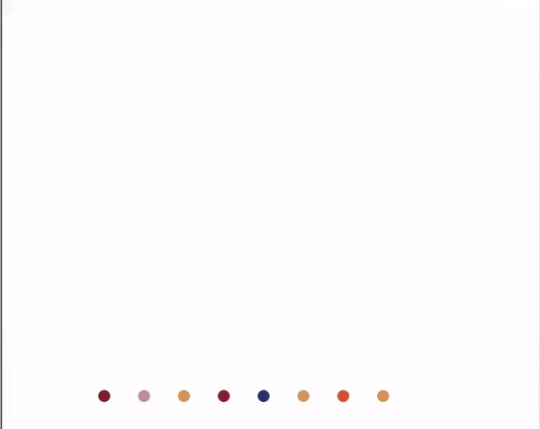

# Hirst-painting
Turtle and Turple manipulation.
<b /> The colorgram package was used to read the colors in the 'image.jpg' which was the Damien Hirst sample to model using Python turtle graphics.
<b /> Thirty colors were extracted and saved to a list. Out of the 30 colors, three were discarded because of the high R or G or B values close to 255
which were almost white.

<b /> The size of the dot is 15 and the distance between dots is 50. The total dots are 100 and the painting approximates 10 dots by 10 dots horizontally and vertically respectively.

<b /> The outcome of the modelling is shown here!

